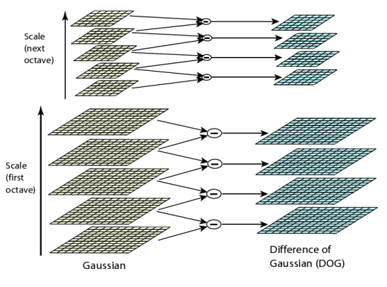
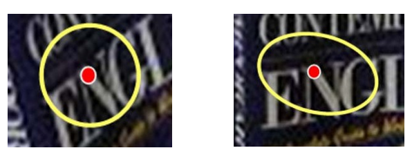
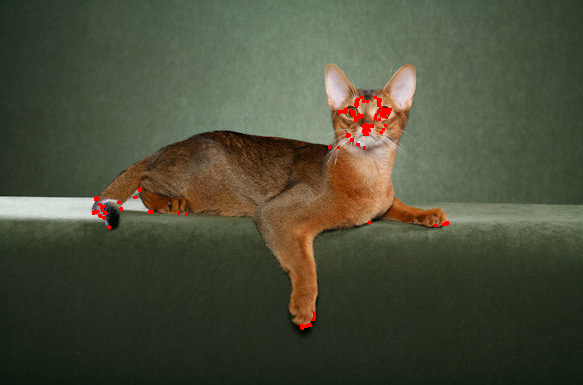
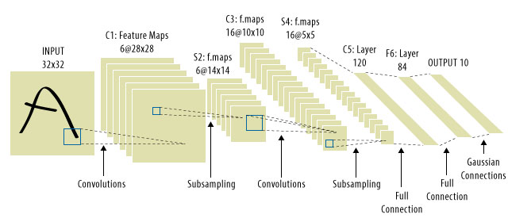
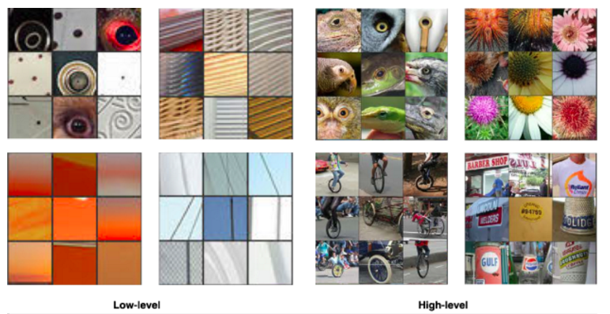
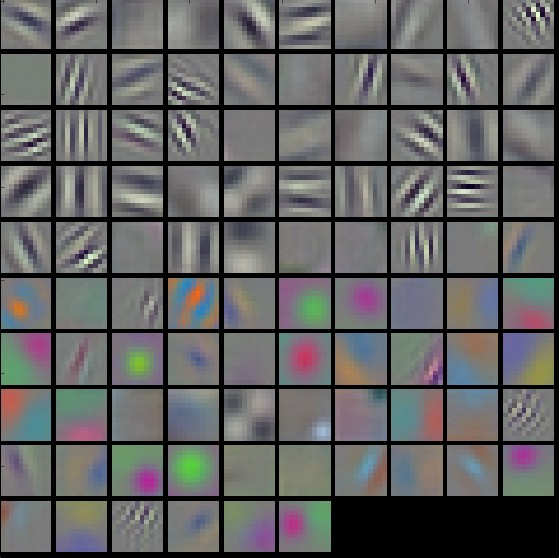

# Advanced Image Analysis
Yuting Ma

W4249: Applied Data Science


## Scale Invariant Feature Transformation (SIFT)

* Scale Invariant Feature Transformation (SIFT) was introduced by D.Lowe, University of British Columbia,in 2004. It is currently one of the most commonly used feature detector and descriptor for image analysis. It operates in 4 parts:
	- Detector
		1. Find Scale-Space Extrema
		2. Keypoint Localization & Filtering
			+ Improve keypoints and throw out bad ones
	- Descriptor
		1. Orientation Assignment
			+ Remove effects of rotation and scale
		2. Create descriptor
			+ Using histograms of orientations

### Feature Detection

#### Scale-Space Extrema Detection
1. Construct a scale space
	* Increase in octave in a number of scale levels

2. Image is convolved with Gaussian filters at different scales
	- $$$L(x, y, k \sigma)$$$ is the convolution of the original image $$$I(x,y)$$$ with Guassian blur $$$G(x, y, k\sigma)$$$ --> $$$L(x, y, k\sigma) = G(x,y, \sigma)*I(x,y) $$$
	- $$$k\sigma$$$ is the scale
3. The difference of successive Gaussian-blurred images are taken --> Difference of Gaussian (DoG) 
	* \\[ D(x, y, \sigma) = L(x, y, k_i \sigma) - L(x, y, k_j \sigma)) \\]= difference at different scales $k_i$ and $k_j$
	
4.  Keypoints are then taken as **maxima/minima** of the Difference of Gaussians (DoG) that occur at multiple scales.

* Parameter to tune:
	- Number of octaves
	- Number of scale levels
	- Initial $$$\sigma$$$
	- Initial $$$k$$$

#### Keypoint Localization
* Scale-space extrema detection results in too many keypoints, some of which are unstable. 
* Keypoint localization used Taylor series expansion of scale space to get more accurate location of extrema
	- It removes detected keypoints with intensity lower than a **constrastThreshold**
	- It removes detected keypoints that are consider to be at the edges.
		+ It uses a 2x2 Hessian matrix (H) to compute the pricipal curvature. If a ratio between the squared trace and the determinant is less than a **edgeThreshold**, the keypoint is discarded. 
* Parameters:
	- constrastThreshold
	- edgeThreshold

### Feature Description
After getting a set of "good" keypoints, we need to quantify the characteristics of the local image patch. 

#### Orientation Assignment
* An orientation is assigned to each keypoint to achieve invariance to image rotation.

* A neigbourhood is taken around the keypoint location depending on the scale, and the gradient magnitude and direction is calculated in that region. (Computation details, see reference.)
* An orientation histogram with 36 bins covering 360 degrees is created
	- It is weighted by gradient magnitude and gaussian-weighted circular window with $\sigma$ equal to 1.5 times the scale of keypoint. 
* The highest peak in the histogram is taken and any peak above 80% of it is also considered to calculate the orientation. It creates keypoints with same location and scale, but different directions. 


* Finally a parabola is fit to the 3 histogram values closest to each peak to interpolate the peak position for better accuracy 
* It contribute to stability of matching.


#### Keypoint Descriptor

SIFT descriptor is a 128-dimenional vector, derived by:

1. Construct a 4*4 gradient Window in correspongding direction
2. Histogram of 4x4 samples per window in 8 directions
3. Gaussian weighting around center( is 0.5 times that of the scale of
a keypoint)


## Use OpenCV-Python for Image Analysis

### Use OpenCV-Python From R 
#### Installation
* Install Python
* Install OpenCV for Python
	- [A Guide of install OpenCV 3.0 and Python 2.7+ on OSX](http://www.pyimagesearch.com/2015/06/15/install-opencv-3-0-and-python-2-7-on-osx/)
	- It is recommended that OpenCV is installed in a virtualenv
* Install R package "rPython"


#### How to Use
1. Open terminal, activate (work on) the virtualenv created with OpenCV by `source myvirtualenv/bin/activate` or `workon myvirtualenv`.

2. Run R in the virtualenv and `library(rPython)`
3. Write a sample Python code with `import cv2` to see if the module can be successfully imported. For instance: 

```
# test.py
import numpy as np
import cv2
img = cv2.imread('cat.jpg')
d = img.shape
```
4.Try to call test.py from R and load variables from Python to R.

```
> library(rPython)
> #Load/run the main Python script
> python.load("test.py")
> # Get the variable from python
> python.load("test.py")
> d <- python.get("d")
> d
[1] 400 600   3
```
* Note that the object loaded from Python to R need to be **JSON serializable**. JSON is a format that encodes objects in a string. Serialization means to convert an object into that string, and deserialization is its inverse operation. When transmitting data or storing them in a file, the data are required to be byte strings, but complex objects are seldom in this format. 
* The most commonly used data structure in Python is `ndarray` from numpy, which is analogous to n-dimensional array in R. However, `ndarray` is not JSON serializable so it cannot be directly loaded to R. To overcome this issue, you can convert `ndarray` to `list` in your Python script. For instance: by adding `x_list = x.tolist()` where `x` is a `ndarray`, it will be read as an list in R. 

#### Potential Problem and Solution
* If you have different version of python
    - From terminal (before open R), eg.: `export RPYTHON_PYTHON_VERSION=2.7.11`
    - always check your `Sys.getenv()` in R.
* When installing OpenCV, after step 7 you may need to restart the system to reconfigure the `.bash_profile` before proceeding to step 8.
* You need to have opencv libraries ready for R to use. So if runs into library error, you may need to copy opencv DYLD libraries to R library: `cp -R ~/opencv/build/lib /Library/Frameworks/R.framework/Resources/lib`
* Unfortunately, I haven't figured out how to configure RStudio to the python virtualenv. RStudio links to the system Python path by default. Hope you can help me with it. 
* Unfortunately too, rPython is currently not available for Windows OS.
	- Solution:
    	- Use some virtual machines like VMware or VirtualBox on windows and install Linux and carry out your work
    	- Call python from R through Rcpp, which basically connect R and python via C++
    	- Directly use python and use intermediate outputs to facilitate the data analysis.
        	- http://gallery.rcpp.org/articles/rcpp-python/
        	- Cons: lack of interactivity


### Use SIFT in OpenCV

```
# test_sift.py
import numpy as np
import cv2
img = cv2.imread('cat.jpg')
gray= cv2.cvtColor(img,cv2.COLOR_BGR2GRAY)
sift = cv2.xfeatures2d.SIFT_create()
(kps, descs) = sift.detectAndCompute(gray, None)
print("# kps: {}, descriptors: {}".format(len(kps), descs.shape))
img=cv2.drawKeypoints(gray,kps, img)
cv2.imwrite('sift_keypoints.jpg',img)
descs_list = descs.tolist()
```
* The output image with key points detected


In R:

```
> python.load("test_sift.py")
> descs_list <- python.get("descs_list")
> # Convert list to array
> img_descs <- do.call()
> length(img_descs)
[1] 305
> img_sift <- do.call("rbind", img_descs)
> dim(img_sift)
[1] 305 128
> img_sift[1:5, 1:5]
     [,1] [,2] [,3] [,4] [,5]
[1,]   56   10    8   13   16
[2,]    3   29   26   35   15
[3,]    0    0    2   36   83
[4,]   71   42    6    1    2
[5,]    0    0    1   16  115
```

### Other Methods in OpenCv
#### Harris Corner Detection
```
# test_corner.py
import cv2
import numpy as np
filename = 'cat.jpg'
img = cv2.imread(filename)
gray = cv2.cvtColor(img,cv2.COLOR_BGR2GRAY)
gray = np.float32(gray)
dst = cv2.cornerHarris(gray,2,3,0.04)
#result is dilated for marking the corners, not important
dst = cv2.dilate(dst,None)
# Threshold for an optimal value, it may vary depending on the image.
img[dst>0.01*dst.max()]=[0,0,255]
cv2.imshow('dst',img)
if cv2.waitKey(0) & 0xff == 27:
    cv2.destroyAllWindows()
```
The detected points are:



And a lot more to be explored. 

## Use Matlab For Image Analysis

### Use SIFT in Matlab

SIFT and other advanced image analysis tools are available in Matlab from library [VlFeat](http://www.vlfeat.org/). The [sample code](http://www.vlfeat.org/applications/caltech-101-code.html) of implementing SIFT in matlab is also avaiable.


### Other Methods 

In addition to the ordinary SIFT, VlFeat also offers some other useful tools for feature extraction and description, which might be more efficient computationally. For instance:

* [MSER feature detector](http://www.vlfeat.org/overview/mser.html)       
* [Dense SIFT](http://www.vlfeat.org/api/dsift.html)
* [HOG features](http://www.vlfeat.org/overview/hog.html)
        	        	
        	        	
## Caffe: A Deep Learning Framework  
The [Caffe framework from UC Berkeley](http://caffe.berkeleyvision.org/) is designed to let researchers create and explore Convolutional Neural Networks (CNN) and other Deep Neural Networks (DNNs) easily. It provides end-to-end learning to many tasks, especially in image recognition. Particularly, Caffe has a pretrained model, CaffeNet, that is trained on one of the most comprehensive image database, [ImageNet](http://image-net.org/), from which the learned features can be extracted from each layer of the neural network. 

The details of Caffe is out of the scope of this class as well as deep learning in general. Here is a very brief and basic introduction to help you understand the structure of Caffe in order to facilitate the usage.   

### Installation
Unfortunately, it is absolutely nontrival to install Caffe appropriatelt and to run it sucessfully. Please see the tutorial for a definitely non-expert installation guide. 

###Automating Perception by Deep Learning


Deep learning is a branch of machine learning that is advancing the state of the art for perceptual problems like vision and speech recognition. We can pose these tasks as mapping concrete inputs such as image pixels or audio waveforms to abstract outputs like the identity of a face or a spoken word. The “depth” of deep learning models comes from composing functions into a series of transformations from input, through intermediate representations, and on to output. The overall composition gives a deep, layered model, in which each layer encodes progress from low-level details to high-level concepts. This yields a rich, hierarchical representation of the perceptual problem. Figure 1 shows the kinds of visual features captured in the intermediate layers of the model between the pixels and the output. A simple classifier can recognize a category from these learned features while a classifier on the raw pixels has a more complex decision to make.

### Convolutional Neural Network


(Demo credit: http://systemdesign.altera.com/can-you-see-using-convolutional-neural-networks/)

A CNN consists of a number of convolutional and subsampling layers followed by fully connected layers, where the "depth" comes from. It maps concrete inputs such as image pixels or audio waveforms to abstract outputs like the identity of a face or a spoken word. 

* Convolutional layer (CONV): 
	- Input:  m x m x r image where m is the height and width of the image and r is the number of channels, e.g. an RGB image has r=3. 
	- The convolutional layer will have k filters (or kernels) of size n x n x q where n is smaller than the dimension of the image and q can either be the same as the number of channels r or smaller and may vary for each kernel. The size of the filters gives rise to the locally connected structure which are each convolved with the image to produce k feature maps of size m−n+1. 
	
	
	
(demo credit: http://deeplearning.stanford.edu/wiki/index.php/Feature_extraction_using_convolution)	
	
* RELU layer:
	- Apply an elementwise activation function, such as the max(0,x) thresholding at zero. This leaves the size of the volume unchanged
* Subsampling layer (POOL):
	- Each map is then subsampled typically with mean or max pooling over p x p contiguous regions where p ranges between 2 for small images (e.g. MNIST) and is usually not more than 5 for larger inputs.
* Fully-connected layer (FC):
	- As with ordinary Neural Networks and each neuron in this layer will be connected to all the numbers in the previous volume.

The overall composition gives a deep, layered model, in which each layer encodes progress from **low-level details** to **high-level concepts**. This yields a rich, hierarchical representation of the perceptual problem.
* Low-level features: simple elements of shapes and colors with small number of pixels.
* High-level features: recognizable components of the output



(Demo credit: https://devblogs.nvidia.com/parallelforall/deep-learning-computer-vision-caffe-cudnn/)

### Extract Features from CaffeNet
(Skip the part of load python object to R, which is similar as OpenCV)

* First, import required modules, set plotting parameters, and run (from /caffe root folder) `./scripts/download_model_binary.py models/bvlc_reference_caffenet` to get the pretrained CaffeNet model if it hasn't already been fetched.

* Load CaffeNet

```
import numpy as np
import matplotlib.pyplot as plt
# Make sure that caffe is on the python path:
caffe_root = '/Users/Yuting_Ma/Downloads/caffe/'  # this file is expected to be in {caffe_root}/examples
import sys
sys.path.insert(0, caffe_root + 'python')
import caffe
plt.rcParams['figure.figsize'] = (10, 10)
plt.rcParams['image.interpolation'] = 'nearest'
plt.rcParams['image.cmap'] = 'gray'
import os
caffe.set_mode_cpu()
net = caffe.Net(caffe_root + 'models/bvlc_reference_caffenet/deploy.prototxt',
                caffe_root + 'models/bvlc_reference_caffenet/bvlc_reference_caffenet.caffemodel',
                caffe.TEST)
```

* For each layer, show the output shape

```
>>> # With CUP-only configuration
>>> for layer_name, blob in net.blobs.iteritems():
>>>     print layer_name + '\t' + str(blob.data.shape)
data	(50, 3, 227, 227)
conv1	(50, 96, 55, 55)
pool1	(50, 96, 27, 27)
norm1	(50, 96, 27, 27)
conv2	(50, 256, 27, 27)
pool2	(50, 256, 13, 13)
norm2	(50, 256, 13, 13)
conv3	(50, 384, 13, 13)
conv4	(50, 384, 13, 13)
conv5	(50, 256, 13, 13)
pool5	(50, 256, 6, 6)
fc6	(50, 4096)
fc7	(50, 4096)
fc8	(50, 1000)
prob	(50, 1000)
```

* Visualize extracted features, for instance, from the first convolution layer:

```
def vis_square(data):
    """Take an array of shape (n, height, width) or (n, height, width, 3)
       and visualize each (height, width) thing in a grid of size approx. sqrt(n) by sqrt(n)"""
    # normalize data for display
    data = (data - data.min()) / (data.max() - data.min())
    # force the number of filters to be square
    n = int(np.ceil(np.sqrt(data.shape[0])))
    padding = (((0, n ** 2 - data.shape[0]),
               (0, 1), (0, 1))                 # add some space between filters
               + ((0, 0),) * (data.ndim - 3))  # don't pad the last dimension (if there is one)
    data = np.pad(data, padding, mode='constant', constant_values=1)  # pad with ones (white)
    # tile the filters into an image
    data = data.reshape((n, n) + data.shape[1:]).transpose((0, 2, 1, 3) + tuple(range(4, data.ndim + 1)))
    data = data.reshape((n * data.shape[1], n * data.shape[3]) + data.shape[4:])
    plt.imshow(data); plt.axis('off')
```   

```
filters = net.params['conv1'][0].data
vis_square(filters.transpose(0, 2, 3, 1))
```


 (Code adapted from [Caffe classification tutorial](http://nbviewer.jupyter.org/github/BVLC/caffe/blob/master/examples/00-classification.ipynb))


* In some research papers ([example](http://arxiv.org/pdf/1402.0453v2.pdf)), people use features extracted from the last 3 fully connected layers of CaffeNet as visual vocabulary for image classification. 


## References
* [OpenCV 3.0 official doumentation](http://docs.opencv.org/3.0-beta/doc/py_tutorials/py_tutorials.html)
* [A Nice SIFT Tutorial](http://www.inf.fu-berlin.de/lehre/SS09/CV/uebungen/uebung09/SIFT.pdf)
* [VlFeat](http://www.vlfeat.org/index.html)
* [Convolutional Neural Network for Visual Recognition](http://cs231n.github.io/convolutional-networks/)
* [Caffe Tutorials](http://caffe.berkeleyvision.org/)
* [Deeplearning.net](http://deeplearning.net/tutorial/lenet.html)
* [Stanford UFLDL Tutorial](http://deeplearning.stanford.edu/wiki/index.php/UFLDL_Tutorial)
